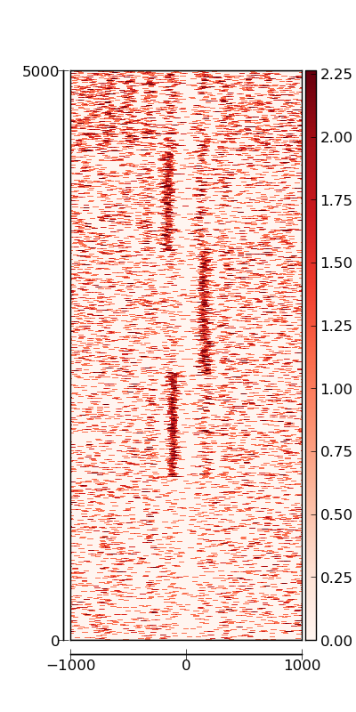

plot_flanking_region
====================

#### This program is used to plot internsities of NGS data around given interval regions. ####
#### It has two functions: ####
  1. plot average internsities for each of multiple datasets (BAM) or each of multiplt groups of intervals
  1. plot heatmap for individual intervals, and separate by groups


### EXAMPLE: ###
  see [test_run.sh](https://github.com/yu68/bam2x/blob/master/protocols/plot_flanking_region/test_run.sh)  
  Output are *.png  
    One Heatmap example:  
      


### HELP: ###
```
usage: plot_flanking_region.py [-h] [-H | -A] [-b BAMS [BAMS ...]]
                               [-i INTERVALS [INTERVALS ...]] [-d]
                               [-r RESOLUTION] [-l LENGTH] [-f FRAG_L]
                               [-n NAMES [NAMES ...]] [-w WIN_L] [-o OUTPUT]

plot heatmap or average patterns for intensities around flanking regions of
interested locations

optional arguments:
  -h, --help            show this help message and exit
  -H, --Heatmap         draw heatmap for intensities of all regions
  -A, --Average         draw average pattern for intensities of all regions
  -b BAMS [BAMS ...], --bams BAMS [BAMS ...]
                        the list of bam files containing raw reads information
                        (only use the first one if choose -H
  -i INTERVALS [INTERVALS ...], --intervals INTERVALS [INTERVALS ...]
                        the list of bed files containing location information
                        of intervals (only use the first one if choose -H
  -d, --direction       consider direction of each interval, useful for TSS
                        around regions (default: False)
  -r RESOLUTION, --resolution RESOLUTION
                        the resolution for counting reads (default: 5)
  -l LENGTH, --length LENGTH
                        the length extending from the center to both
                        directions to be drawn (default: 1000)
  -f FRAG_L, --frag_l FRAG_L
                        the average length of seqeuncing fragments, used to
                        determine center location of each read (default: 300,
                        150 for MNase-seq)
  -n NAMES [NAMES ...], --name NAMES [NAMES ...]
                        names of the groups (either intervals or bams, can be
                        multiple for only one type) to draw average patterns)
  -w WIN_L, --win_l WIN_L
                        smooth window length for counts in each interval,
                        (default:3, no smooth)
  -o OUTPUT, --output OUTPUT
                        suffix of output figure file,can be (pdf, eps,
                        png,jpg,...) final will be average_* or heatmap_*

Library dependency : xplib, pylab, scipy, numpy, pysam, matplotlib
```
